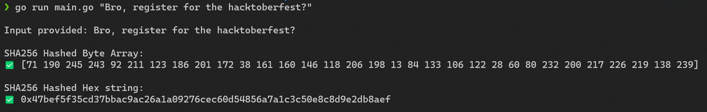

# SHA256 Hashing Algorithm Implementation

This program attempts to find the SHA256 cryptographic hash of any input provided by the user and works as a CLI application.

- Make sure `Go` is installed on your machine

- Change to the working directory:
    ```shell
    $ cd SHA256_implementation
    ```
- Run the following command:
    ```shell
    $ go run main.go "<input_string_here>"
    ```

**Example**:

